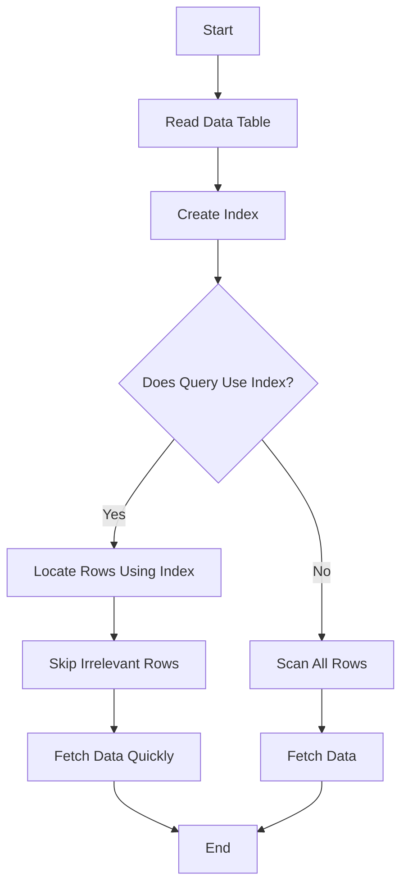

---
# You can also close(false) or open(true) something for this content.
# P.S. comment can only be closed
comment: false
toc: true
autoCollapseToc: false
postMetaInFooter: false
hiddenFromHomePage: false
# You can also define another contentCopyright. e.g. contentCopyright: "This is another copyright."
contentCopyright: false
reward: false
mathjax: false
mathjaxEnableSingleDollar: false
mathjaxEnableAutoNumber: false

# You unlisted posts you might want not want the header or footer to show
hideHeaderAndFooter: false

# You can enable or disable out-of-date content warning for individual post.
# Comment this out to use the global config.
#enableOutdatedInfoWarning: false

flowchartDiagrams:
  enable: false
  options: ""

sequenceDiagrams:
  enable: false
  options: ""

title: "Sqlite Understanding Indexes in Sqlite"
date: "2025-01-20 22:29:20+08:00"
lastmod: "2025-01-20 22:29:20+08:00"
draft: false

keywords: [sqlite3]
tags: [sqlite3]
categories: [tech]
author: "guanyc"
aliases: []

description: ""
summary:

weight: 500
type: docs

featured_image:


---


### Speech Between David and James: Understanding SQLite Indexes

---

**David**: Hey James, have you ever wondered how SQLite makes queries faster? I mean, when you're searching for records in a database, how does it know where to look?

**James**: Yeah, it's something I've been curious about. I know there’s some kind of trick behind it, but I’m not sure how it works. 

**David**: Well, it’s all about **indexes**. Indexes are like the table of contents in a book. Instead of flipping through every page, you go straight to the section you need. In a database, indexes speed up search queries.

**James**: Ah, okay, so it’s like creating a shortcut to data? But how do they actually work in SQLite?

**David**: Exactly! When you create an index on a column, SQLite creates a **lookup table** that stores the values in that column along with pointers to the corresponding rows in the database. This way, when you run a query that searches for a specific value, SQLite can find the matching record without having to scan every row in the table.

**James**: Got it! So, it’s like a map for the database, guiding SQLite to the exact spot. Can you show me a quick example?

**David**: Sure! Let’s say we have a table called `Students`:

```sql
CREATE TABLE Students (
    ID INTEGER PRIMARY KEY,
    Name TEXT,
    Age INTEGER
);
```

Now, if we want to find a student by **Name**, we could create an index on the `Name` column:

```sql
CREATE INDEX idx_name ON Students(Name);
```

Now, if we search by `Name`, SQLite will use that index instead of scanning every row:

```sql
SELECT * FROM Students WHERE Name = 'Alice';
```

SQLite will jump straight to the `Name` index, find ‘Alice’, and quickly retrieve the record.

**James**: Oh, that sounds super helpful! So, it’s like using a specific drawer instead of looking through the whole filing cabinet. But are there any downsides?

**David**: Good question. The **pitfall** is that indexes come with a cost. While they speed up searches, they slow down **inserts**, **updates**, and **deletes**. That's because every time you modify data, SQLite has to update the index too. So, if your table is very large and you're doing a lot of inserts, you might want to avoid unnecessary indexes.

**James**: Hmmm, so it’s all about balancing speed and performance. Are there other types of indexes, or is the one we created enough for most cases?

**David**: There are several types! The most common one is a **single-column index** like the one we just created. But SQLite also supports **composite indexes**, where you create an index on multiple columns.

For example, if you have a table with `Name` and `Age`, and you often query both together:

```sql
CREATE INDEX idx_name_age ON Students(Name, Age);
```

This index will make queries like:

```sql
SELECT * FROM Students WHERE Name = 'Alice' AND Age = 20;
```

...much faster.

**James**: So, composite indexes are great when I query multiple columns together. But when should I **avoid** creating indexes?

**David**: Good point. Avoid indexes when:

- You have **small tables** or rarely run queries.
- Your queries don’t often search on specific columns.
- You have **high write operations** (because indexing every write operation adds overhead).

Indexes are only useful when you're frequently querying the data based on that column.

**James**: Got it! So, indexing isn’t a “one-size-fits-all” solution, huh?

**David**: Exactly! Think of indexes like a **tool** in your toolbox. You need to use the right one for the job.

---

### Key Takeaways:
- **Indexes** improve query performance by creating a lookup table for fast data retrieval.
- SQLite supports both **single-column** and **composite** indexes.
- Indexes can **slow down write operations**, so use them only when needed.
- The right index can significantly speed up your database queries, but you need to balance between reads and writes.

---

### Example Exercise:

1. **Create a table** with columns `ID`, `Name`, and `Age`.
2. **Insert some records** into the table.
3. **Create an index** on the `Name` column.
4. **Write queries** to fetch data using the indexed column and see the performance difference with and without the index.

---

### References:
- [SQLite Official Documentation](https://www.sqlite.org/docs.html)
- [SQLite Indexes: Benefits and Pitfalls](https://www.geeksforgeeks.org/sqlite-indexes-benefits-and-pitfalls/)

---

### Keywords:
- SQLite, Index, Query, Composite Index, Database Performance, Insert, Update, Delete, Table of Contents, Optimization, Pitfalls

---

### Featured Image:



This flowchart succinctly outlines the process from reading the data table to finally fetching the data, emphasizing the role of the index in optimizing query performance.

The flowchart abstracts the logic into key steps:

Starting the process.
Reading the data table.
Creating an index.
Checking if the query uses the index.
If yes, it locates rows using the index and skips irrelevant rows for faster data retrieval.
If no, it scans all rows to fetch the data.
Finally, the process ends after fetching the data.