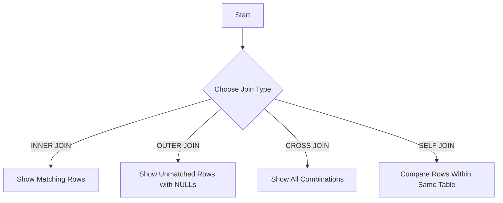

---
# You can also close(false) or open(true) something for this content.
# P.S. comment can only be closed
comment: false
toc: true
autoCollapseToc: false
postMetaInFooter: false
hiddenFromHomePage: false
# You can also define another contentCopyright. e.g. contentCopyright: "This is another copyright."
contentCopyright: false
reward: false
mathjax: false
mathjaxEnableSingleDollar: false
mathjaxEnableAutoNumber: false

# You unlisted posts you might want not want the header or footer to show
hideHeaderAndFooter: false

# You can enable or disable out-of-date content warning for individual post.
# Comment this out to use the global config.
#enableOutdatedInfoWarning: false

flowchartDiagrams:
  enable: false
  options: ""

sequenceDiagrams:
  enable: false
  options: ""

title: "400 Sqlite Understanding Sql Joins in Sqlite"
date: "2025-01-19 23:38:10+08:00"
lastmod: "2025-01-19 23:38:10+08:00"
draft: false

keywords: [sqlite3]
tags: [sqlite3]
categories: [tech]
author: "guanyc"
aliases: []

description: ""
summary:

title: "Table Relationships, Joins in SQLite"

type: docs

weight: 80

featured_image:


---

Sure! Here's a long, consolidated article that combines the explanations on **INNER JOIN**, **OUTER JOIN**, **CROSS JOIN**, and **SELF JOIN** in a single piece. It's structured with casual, conversational explanations between David and James, alongside examples, pitfalls, highlights, and exercises.

---

# Understanding SQL Joins in SQLite: A Comprehensive Guide

SQL joins can be a powerful tool in your database arsenal, and understanding them is key to mastering data retrieval. Whether you’re combining data from two tables, handling missing relationships, or even dealing with complex self-references, joins are your go-to tool.

In this guide, we’ll break down four common types of joins you’ll use in SQLite: **INNER JOIN**, **OUTER JOIN** (including LEFT JOIN and RIGHT JOIN), **CROSS JOIN**, and **SELF JOIN**. We'll cover them in a casual, conversational way with plenty of examples, pitfalls to avoid, highlights, and exercises. Let's dive in!

---

### **INNER JOIN: Fetching Related Data**

**David**:  
Hey James! You’re getting pretty good at SQLite, huh? You’ve probably heard of something called an "INNER JOIN" by now?

**James**:  
Yeah, I’ve seen it a few times, but I’m not quite sure how it works. Could you explain it?

**David**:  
Sure! The `INNER JOIN` is one of the most commonly used SQL operations. It helps you fetch related data from two tables. Essentially, it combines rows from both tables where there’s a match based on some condition. So, if you have two tables—say, one for `students` and another for `courses`—an `INNER JOIN` will only return the students who are enrolled in a course.

**James**:  
That sounds useful! Can you show me an example?

---

### **David**:  
Definitely. Let’s say you have the following two tables:

- **students**  
| student_id | name      | age |
|------------|-----------|-----|
| 1          | Alice     | 14  |
| 2          | Bob       | 15  |
| 3          | Charlie   | 14  |

- **enrollments**  
| student_id | course      |
|------------|-------------|
| 1          | Math        |
| 2          | Science     |
| 1          | English     |

Now, let’s say you want to list the students along with the courses they’re enrolled in. Here’s the query:

```sql
SELECT students.name, enrollments.course
FROM students
INNER JOIN enrollments
ON students.student_id = enrollments.student_id;
```

**James**:  
Wait, so this query is matching the `student_id` from both tables? And that’s how it knows which student is in which course?

**David**:  
Exactly! The `ON` keyword specifies the condition for the join. It tells SQLite to match rows from both tables where the `student_id` is the same.

---

### **Example Breakdown**:
- Alice is in Math and English, so her name appears twice in the result.
- Bob is only enrolled in Science, so he shows up once.
- Charlie is not in any course in the `enrollments` table, so they won’t appear at all.

The output would look like this:

| name    | course   |
|---------|----------|
| Alice   | Math     |
| Alice   | English  |
| Bob     | Science  |

---

### **Pitfalls to Watch Out For**

**James**:  
This seems pretty simple, but I’m guessing there are some traps I should avoid, right?

**David**:  
Yeah, here are a few common pitfalls:
1. **Missing Matches**: If a row in the first table doesn’t have a corresponding match in the second table, it won’t appear at all.
2. **Duplicate Data**: If the condition in the `ON` clause creates multiple matches, you’ll get duplicate rows.
3. **Column Naming**: If both tables have columns with the same name, you’ll need to specify which one you mean.

---

### **OUTER JOIN: Handling Missing Relationships**

**James**:  
I’m getting the hang of INNER JOINs, but what if I want to list all students, even those who aren’t enrolled in a course?

**David**:  
That’s where **Outer Joins** come in! An **Outer Join** lets you include all rows from one table (the "left" or "right" table), even if there’s no matching row in the other table. There are a few types of Outer Joins:

- **LEFT OUTER JOIN**: Returns all rows from the left table and the matching rows from the right table. If there’s no match, you’ll get `NULL` for the missing data.
- **RIGHT OUTER JOIN**: Similar to LEFT JOIN but for the right table. SQLite doesn’t directly support this, but you can simulate it by reversing the tables in a LEFT JOIN.
- **FULL OUTER JOIN**: Returns all rows from both tables, but SQLite doesn’t support this natively.

---

### **David**:  
Let’s say we use the same tables as before:

- **students**  
| student_id | name     | age |
|------------|----------|-----|
| 1          | Alice    | 14  |
| 2          | Bob      | 15  |
| 3          | Charlie  | 14  |

- **courses**  
| student_id | course    |
|------------|-----------|
| 1          | Math      |
| 2          | Science   |

Here’s how you can use a `LEFT JOIN` to get all students and their courses:

```sql
SELECT students.name, courses.course
FROM students
LEFT JOIN courses
ON students.student_id = courses.student_id;
```

The result would be:

| name    | course  |
|---------|---------|
| Alice   | Math    |
| Bob     | Science |
| Charlie | NULL    |

---

### **Pitfalls to Watch Out For**
1. **NULL Values**: If there’s no match, you’ll get `NULL` values. Be careful when performing calculations.
2. **Performance**: Outer joins can be slower, especially with large datasets.
3. **FULL OUTER JOIN**: SQLite doesn’t support this directly, so you’ll need to combine `LEFT JOIN` and `RIGHT JOIN` manually for similar results.

---

### **CROSS JOIN: The Cartesian Product**

**James**:  
What about `CROSS JOIN`? That sounds a bit strange.

**David**:  
Yeah, a `CROSS JOIN` is pretty unique. It combines **every row from the first table with every row from the second table**. It’s known as the **Cartesian Product**, and it can result in a large dataset if both tables are big.

For example, if one table has 3 rows and another has 4 rows, a `CROSS JOIN` will give you 12 rows (3 * 4).

---

### **David**:  
Let’s use two tables again:

- **colors**  
| color_id | color_name |
|----------|------------|
| 1        | Red        |
| 2        | Blue       |

- **shapes**  
| shape_id | shape_name |
|----------|------------|
| 1        | Circle     |
| 2        | Square     |

Here’s how you can perform a `CROSS JOIN`:

```sql
SELECT colors.color_name, shapes.shape_name
FROM colors
CROSS JOIN shapes;
```

The output would look like this:

| color_name | shape_name |
|------------|------------|
| Red        | Circle     |
| Red        | Square     |
| Blue       | Circle     |
| Blue       | Square     |

---

### **Pitfalls to Watch Out For**
1. **Large Result Sets**: Be cautious with large tables; the result set grows quickly.
2. **Unnecessary Joins**: Only use a `CROSS JOIN` when you actually need every possible combination.

---

### **SELF JOIN: Comparing Rows Within the Same Table**

**James**:  
What about **SELF JOIN**? That sounds even weirder.

**David**:  
A **SELF JOIN** is when you join a table with itself. It’s useful for hierarchical data, like when employees have managers who are also employees.

---

### **David**:  
Let’s say you have an **employees** table:

| employee_id | name     | manager_id |
|-------------|----------|------------|
| 1           | Alice    | NULL       |
| 2           | Bob      | 1          |
| 3           | Charlie  | 1          |
| 4           | David    | 2          |

If you want to see who works for whom, you can do a **SELF JOIN**:

```sql
SELECT e.name AS employee_name, m.name AS manager_name
FROM employees e
LEFT JOIN employees m
ON e.manager_id = m.employee_id;
```

The result would look like this:

| employee_name | manager_name |
|---------------|--------------|
| Alice         | NULL         |
| Bob           | Alice        |
| Charlie       | Alice        |
| David         | Bob          |

---

### **Pitfalls to Watch Out For**
1. **Alias Confusion**: Always use aliases to distinguish between the different instances of the same table.
2. **Complex Queries**: Self joins can get complicated, especially with multiple levels of hierarchy.

---

### **Exercises**

1. **INNER JOIN Exercise**:  
   Create two tables: `employees` and `departments`. Use an `INNER JOIN` to list all employees and the departments they belong to.

2. **OUTER JOIN Exercise

**:  
   Using a `LEFT JOIN`, list all students and their courses, including students who aren’t enrolled in any course.

3. **CROSS JOIN Exercise**:  
   Create two tables: `products` and `colors`. Use a `CROSS JOIN` to list all possible combinations of products and colors.

4. **SELF JOIN Exercise**:  
   Create a `companies` table with columns for `employee_id`, `name`, and `manager_id`. Use a `SELF JOIN` to find out who works for whom.

---

### **References**
- [SQLite JOIN Documentation](https://www.sqlite.org/lang_select.html)

---

### **Keywords**: SQL, Joins, INNER JOIN, OUTER JOIN, CROSS JOIN, SELF JOIN, SQLite, SQL Queries, Cartesian Product, Hierarchical Data, SQL Tutorials

---

### Featured Image

