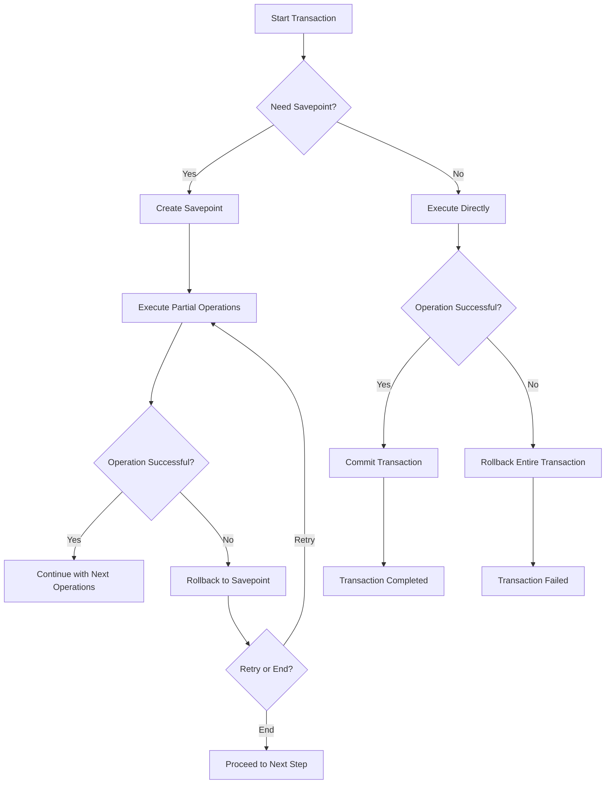

---
# You can also close(false) or open(true) something for this content.
# P.S. comment can only be closed
comment: false
toc: true
autoCollapseToc: false
postMetaInFooter: false
hiddenFromHomePage: false
# You can also define another contentCopyright. e.g. contentCopyright: "This is another copyright."
contentCopyright: false
reward: false
mathjax: false
mathjaxEnableSingleDollar: false
mathjaxEnableAutoNumber: false

# You unlisted posts you might want not want the header or footer to show
hideHeaderAndFooter: false

# You can enable or disable out-of-date content warning for individual post.
# Comment this out to use the global config.
#enableOutdatedInfoWarning: false

flowchartDiagrams:
  enable: false
  options: ""

sequenceDiagrams:
  enable: false
  options: ""

title: "Sqlite Using Savepoints for Nested Transactions in Sqlite"
date: "2025-01-20 09:58:20+08:00"
lastmod: "2025-01-20 09:58:20+08:00"
draft: false

keywords: [sqlite3]
tags: [sqlite3]
categories: [tech]
author: "guanyc"
aliases: []

description: ""
summary:

weight: 430
type: docs

featured_image:


---
### **Speech Between David and James on Using Savepoints for Nested Transactions in SQLite**

**David**: Alright, James, we’re diving a bit deeper into SQLite today. Have you heard of **savepoints**?

**James**: Hmm, I’ve seen it in some code examples, but I’m not sure what it really does. Isn't it related to nested transactions?

**David**: Exactly! Savepoints allow you to create **sub-transactions** within a transaction. It's like putting a **bookmark** in the middle of a transaction, so you can **rollback** to it if something goes wrong without losing everything. Kind of like undoing a mistake without restarting from scratch.

**James**: So, it's like making checkpoints inside a big transaction? Like, if something fails, I can go back to the last checkpoint instead of rolling everything back?

**David**: Bingo! Imagine you're doing a big task, and halfway through, you realize you need to undo part of it, but you don’t want to lose the whole thing. Savepoints let you roll back just to that checkpoint and keep the rest intact.

**James**: Ah, that makes sense. So, you can nest these savepoints inside each other?

**David**: Yep! It’s like nesting Russian dolls. You can have a savepoint inside another, and each one can be rolled back independently. Let me show you an example of how this works in SQLite.

### **Example in SQLite**:

Let’s say we’re managing a library database, and we need to update a book’s details while also logging the transaction in another table. Here’s how you might do it with **savepoints**:

```sql
BEGIN TRANSACTION; -- Start a main transaction

SAVEPOINT update_book; -- Create a savepoint

UPDATE books SET title = 'New Book Title' WHERE book_id = 1;

-- Something goes wrong, so we want to undo only this part, not the entire transaction
ROLLBACK TO SAVEPOINT update_book;

-- Do another update after rolling back
SAVEPOINT log_transaction;
INSERT INTO transaction_log (action, book_id) VALUES ('Updated Title', 1);

-- Everything works fine, commit the changes
COMMIT;
```

**David**: In this example, if the update to the book’s title fails, we can use `ROLLBACK TO SAVEPOINT` to go back to the point right after `SAVEPOINT update_book`. But we keep the transaction to log the transaction in the `transaction_log` table.

**James**: So, it’s like a **checkpoint** where you can go back to that specific part of the transaction? And if I make a mistake after that, I only undo that part, not the whole thing?

**David**: Exactly. If something fails after `log_transaction`, the changes before that are kept intact. It helps avoid unnecessary rollbacks, especially in complex transactions. Now, a quick reminder, **savepoints** are like any other transaction feature—if you forget to **commit** the main transaction, nothing gets saved, even if the savepoints are fine.

**James**: Got it! So, even if I roll back to a savepoint, if I don't commit, I won’t keep anything?

**David**: Right! **Committing** the entire transaction is key, and **savepoints** just give you more control over which parts of the transaction you want to keep.

---

### **Pitfalls in Savepoints**:
1. **Forgetting to Commit**: If you forget to commit the main transaction after using savepoints, no changes will be saved, even if some savepoints were successful.
2. **Nested Savepoints**: Overusing or nesting too many savepoints might make your code messy or hard to manage. It's better to use them only when necessary.
3. **Performance Overhead**: While useful, savepoints add some overhead to the transaction. Too many nested savepoints can slow down performance, especially in larger databases.
4. **Rolling Back Too Much**: If you keep rolling back to savepoints, you may end up in a state where very little gets committed. Plan your transactions carefully to avoid this.

---

### **Exercise:**

**Scenario**: You’re managing a store’s inventory system and need to update both product stock and customer purchase records in one transaction. Use savepoints to ensure the following:

1. If the stock update fails, only that part of the transaction is rolled back.
2. If the purchase record insertion fails, only that part is rolled back, keeping the stock update intact.

**Steps**:
- Start a transaction.
- Use savepoints for both the stock update and the customer record insertion.
- Commit if everything is successful or roll back to the savepoint if an error occurs.

---

### **References**:
1. SQLite Documentation on Savepoints: [SQLite Savepoints](https://www.sqlite.org/lang_savepoint.html)
2. "Learning SQL" by Alan Beaulieu – A good book on SQL basics with examples.
3. "SQL for Smarties" by Joe Celko – Explains advanced SQL topics, including savepoints.

---

### **Keywords**:
- Savepoints
- Nested Transactions
- SQLite
- Rollback
- Commit
- Sub-transactions
- Data Integrity
- Checkpoints
- Transaction Management
- Error Handling

---

### **Featured Image**:  



1. [Sqlite Using Savepoints for Nested Transactions in Sqlite](https://www.sqlite.org/lang_savepoint.html)